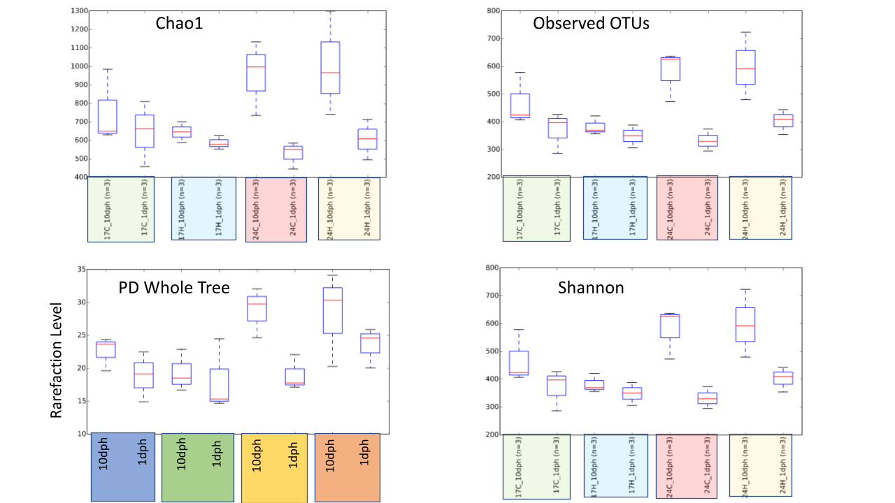
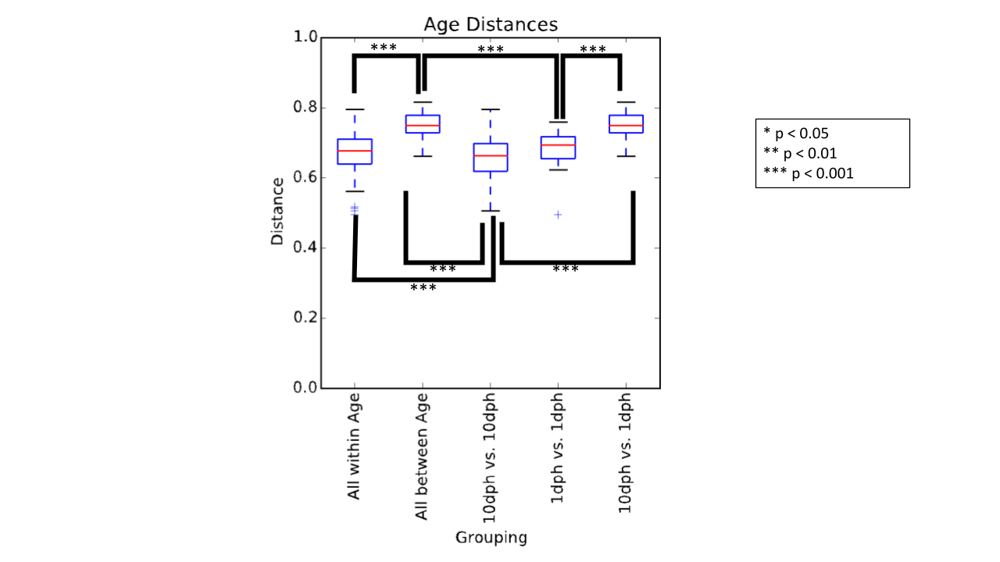

# atlantic-silverside-microbiome
Microbiome analysis of Atlantic silversides under varying temperature and pH conditions using QIIME2 and DADA2

## Project Summary
Increasing atmospheric CO2 levels intensify ocean warming and acidification, which impacts the fitness of marine organisms. However, the combined effects of these stressors on the development of fish holobionts (the host fish and its associated microbiota) remain poorly understood. This project investigates the effects of temperature and pH on Atlantic silversides (Menidia menidia) and their microbiome to predict holobiont fitness and potential adaptation to global change.

## Objective

- Determine how environmental stressors (temperature and pH) affect microbiome composition in developing Atlantic silversides.
- Assess alpha and beta diversity changes across treatments.
- Evaluate potential interactions of stressors on holobiont development.

## Experimental Design
- Species: Atlantic Silverside (Menidia menidia)
- Developmental Stages: 1 day post-hatching (1 dph) and 10 days post-hatching (10 dph)
- Temperatures: 17°C (low), 20°C (medium), 24°C (high)
- pH Conditions: 7.2–7.5 (Control/High), 8.2 (Very High)
- Replicates: 3 biological replicates per treatment

## Designs:
- Preliminary: 2×2 factorial — two temperatures (17°C, 24°C) × two pH (7.2, 8.2) × two ages (1 dph, 10 dph)
- Follow-up: 3×3 factorial — three temperatures (17°C, 20°C, 24°C) × three pH values (7.2, 7.5, 8.2) × 10 dph fish

## Preliminary Results
- Age is the strongest predictor of microbiome species richness.
- Temperature increases microbial diversity (p < 0.05), while pH alone has no significant effect.
- At 10 dph, temperature and pH interact to affect alpha diversity and microbiome composition (p < 0.05).

### Alpha Diversity

**Figure 1**: _Alpha diversity metrics (Chao1, Observed OTUs, PD Whole Tree, Shannon) across temperature and age treatments. Fish at 10 days post-hatching (10 dph) consistently show higher species richness and diversity than 1 dph fish across all metrics and temperature conditions, suggesting developmental stage is the dominant driver of microbiome diversity._

### Beta Diversity – Age Effect

**Figure 2**: _Principal Coordinates Analysis (PCoA) of unweighted UniFrac distances grouped by developmental age. Age significantly structures microbiome composition across all samples (PERMANOVA p = 0.001), with 1 dph and 10 dph fish forming distinct communities. Homogeneity of dispersion confirmed (PERMDISP p > 0.05)._

### Developmental Timepoint Distances

**Figure 3**: _Pairwise unweighted UniFrac distances within and between developmental timepoints. Between-age distances (1 dph vs. 10 dph) are significantly greater than within-age distances (p < 0.001), confirming that microbiome composition shifts substantially over early development regardless of treatment._

## Presentations & Recognition
reliminary findings were presented at the [2018 URECA Undergraduate Research 
Symposium](Results/URECA%202018%20Symposium%20Abstract.pdf) at Stony Brook University. 
The abstract and poster are available in the [`Results/`](Results/) folder.

## Broader Goals
- Predict holobiont fitness under future ocean conditions.
- Provide insight into potential acclimation or adaptation of fish microbiomes to environmental change.
- Develop bioinformatics teaching materials for amplicon-based metagenomics analysis (QIIME2, DADA2).

## Bioinformatics Pipeline
- Data preprocessing: FastQ files demultiplexed and primers removed using QIIME2 cutadapt.
- Quality control and trimming: QIIME2 and DADA2 pipelines for filtering, trimming, and denoising.

## Diversity Analysis
- Alpha diversity (Shannon, Simpson, Observed species)
- Beta diversity (Bray–Curtis, Unifrac)
- PERMANOVA and PERMDISP tests
- Differential abundance: DESeq2 used for identifying taxa affected by temperature and pH.
- Visualization: QIIME2 visualization outputs (.qzv) and R plotting for exploratory analysis.

## Data & Metadata
- Raw sequence files: [Silverside Microbiome Data]([https://drive.google.com/drive/folders/0B8ehrdajsG9IfkxYZ3A3bUZsRktRZzYtS21jSDVUcXQyekM0V1d2TEZBSVFsUmRrZWplRk0?resourcekey=0-q_BhlFzc7jN6Le8SYBvS6w&usp=sharing](https://drive.google.com/drive/folders/1t3WjjesptLZw9ZknB9ead6_Diw84-HgV?usp=sharing))
- Metadata file: metadata.tsv with columns for sample_id, dph, temperature_C, pH_condition, replicate, and experiment ID.
- Mapping files used for QIIME2 import provided for reproducibility.

## Next Steps
- Complete 3×3 factorial analysis for 10 dph fish.
- Integrate microbiome data with physiological measures to predict holobiont fitness.
- Publish findings and include dataset and analysis workflow on GitHub for open science.
